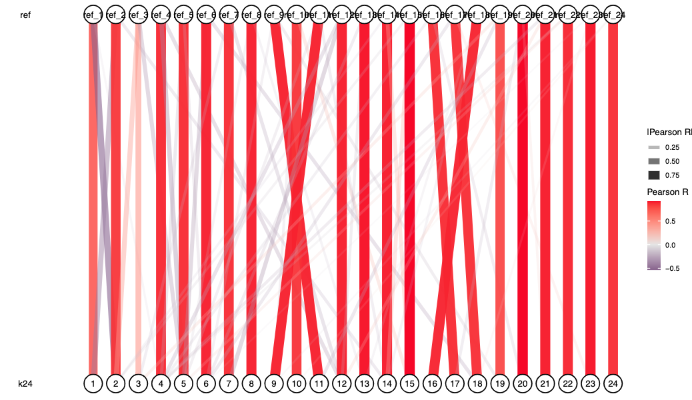
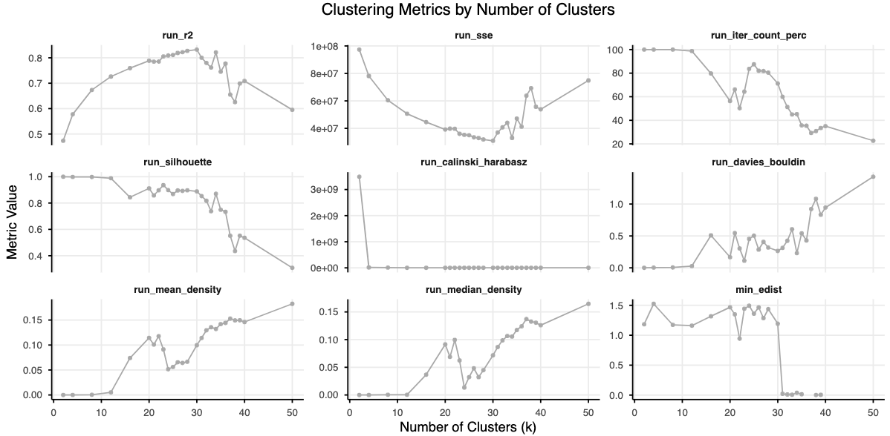
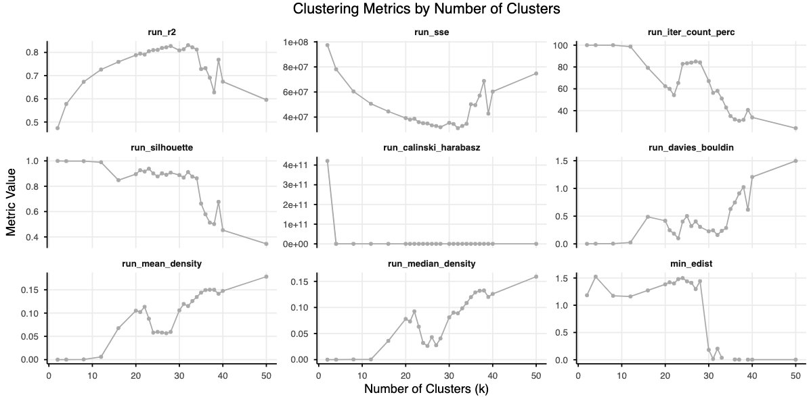

# Notes on cNMF

Consensus NMF is a useful analysis, but it is important to understand a couple of key things. I recommend reading "7 Understanding cNMF outputs" first. The following page contains key notes and thoughts important for interpreting the output. These are anecdotal and experience-based observations; every dataset is different, so make sure to make your own evaluations.

## Filtering input genes & HVG selection can affect results

While NMF is pretty robust, input gene filtering can have an impact. First, which genes you include will affect HVG selection. Second, the amount of HVGs will also affect how accurate the decomposition will be. It seems 2000 is a reasonable starting point for most data, but you may want to test how adding more affects things. Adding more will increase running time and memory use.

While you get gene spectra scores for all genes, these are inferred for non-HVGs, and the decomposition is only done on HVGs. In practice this may work fine, but something to keep in mind.

If supplying the biotype filter in the pipeline, genes are filtered prior to running HVG selection, so only the biotypes you supply will be input, and other genes removed.

You may also want to do some light expression filtering, although HVG selection should take care of filtering the noise. But especially with large datasets, reducing the number of genes can help save space and memory, so filtering out genes expressed in less than 1% of cells or something similar can be helpful.

Anecdotally, as long as you capture enough genes you will still accurately capture the major patterns in the data, but results may vary for more subtle signals.

## cNMF usages are not corrected for batch by default

The usages in cNMF are not batch corrected, as these are inferred on the "raw" TPM matrix, so make sure to include a batch term when modelling usages. The spectra are derived from batch-corrected counts.

If using scVI to batch correct, the option `params.preprocess.scvi.denoise_tp10k` can save a batch corrected TPM matrix, but NMF spectra will only be available for the HVGs input into scVI, not for all genes as usual. Currently the Harmony correction implementation does not offer an option to use corrected counts for usage inference.

See also: https://github.com/immunogenomics/starCAT/issues/5

## Spectra score and spectra TPM are related but not the same

- The "spectra_score" fits the usage matrix for all genes to the per-gene unit-scaled TPM matrix using OLS
- The "spectra_tpm" fits the usage matrix for all genes to the TPM matrix directly with NNLS

The spectra score assumes the scaled TPM values meet OLS assumptions (which may not always be true), but it is comparable between genes as a measure of association strength. The issue with the spectra TPM scoring is that they are not comparable across genes because the overall expression level of the gene is baked in, so a lowly expressed gene that is strongly associated with a program will get downweighted in this scoring.

See also: https://github.com/dylkot/cNMF/issues/98

## The iteration distance heatmap is NOT ordered by GEP number

The distance heatmap produced by cNMF is NOT ordered according to the GEP number. Instead, it is ordered by the k-means cluster number that forms the GEPs. Because the GEP output files are re-ordered based on the total normalized usage across all cells, but this heatmap is ordered by the cluster labels, they are disconnected.

## cNMF default k-selection plot does NOT filter the outlier iterations

The stability vs error plot ignores the filtering of iterations, giving a misleading sense of the actual error of the reconstruction after filtering. The plots produced by sc-blipper are based on the filtered reconstruction, which is why the silhouette score and the reconstruction error may differ.

## More programs is not always better
The consensus programs are derived from k-means clustering after filtering for local density "outliers." This means if your run's local density is too strict and many iterations are filtered out prior to clustering, cNMF will still try and produce k clusters regardless, even though all the iterations that may have made up that program could have been filtered out. This can lead to a nonsense result.

sc-blipper's diagnostic plots help identify this issue with plots of the proportion of iterations filtered and by quantifying the error using the final spectra as used, making it easy to spot this.

In the program summary table, the number of iterations that went into a program as well as the minimal e-distance to other programs are reported. These metrics can be useful to identify problematic programs in an otherwise good overall run.

## Seeds can matter

The pipeline is reproducible, but steps in cNMF and pre-processing like scVI have a stochastic component. By default, the config seeds are set (`params.cnmf.seed=42` and `params.preprocess.scvi.seed=314`), so you should get the same results with every run, but you may want to change these seeds to evaluate the impact of the stochastic component. If set to `null` you will get a random seed selected for each step in the process. When evaluating the impact of the seeds, I would still recommend setting the seeds explicitly, even if you manually generate a random number just to ensure reproducibility.

Anecdotally, the majority of the programs are invariant to the seed selection in a well-defined clustering (Figure 1), but in murky cases, program spectra may shift (Figure 2). In anectotal testing, based on 100 iterations the seed for cNMF does not seem to impact the results hugely, as can be seen by the correlation between spectra scores being very high (Figure 1). However, they are not identical, so do your own evaluation, and it might be worth after selecting a optimal K, to re-run a subset with more iterations to achieve a more stable result.

**Figure 1: Correlation between spectra scores of repeat of cNMF run with a different seed at k=24**

**Figure 2: K selection plots for a re-run with different cNMF seeds**

With regards to the seed for scVI, I have not conducted a formal test, but it seems that this does introduce a bit more variability as it seems it has a larger stochastic component. Increasing the number of epochs, or optimizing the hyperparameters may help to achieve a more stable result, but this is a bit out of scope for this documentation. Anecdotally, the defaults work well enough to achieve a sensible level of replication, but make your own evaluations if you want to be sure for your data.

