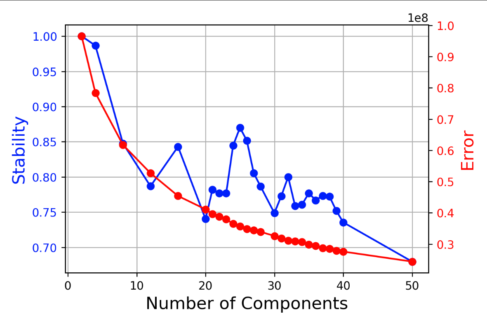
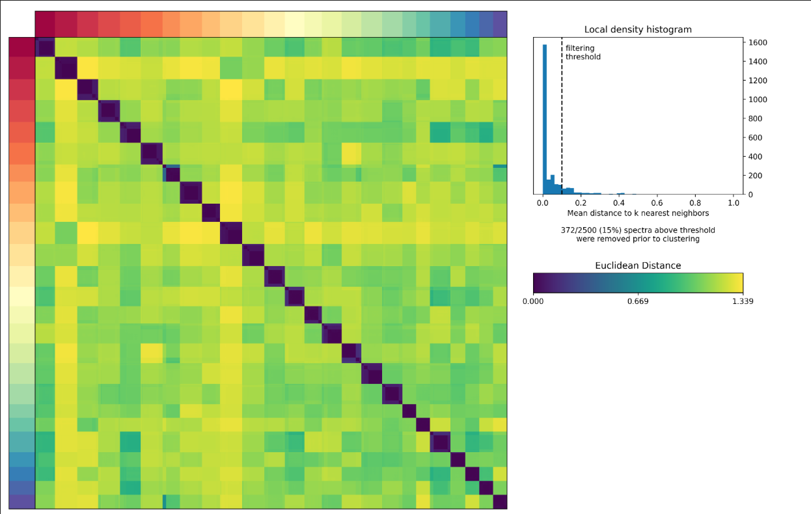
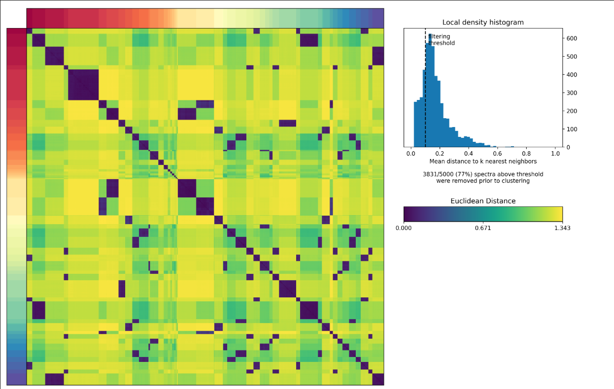
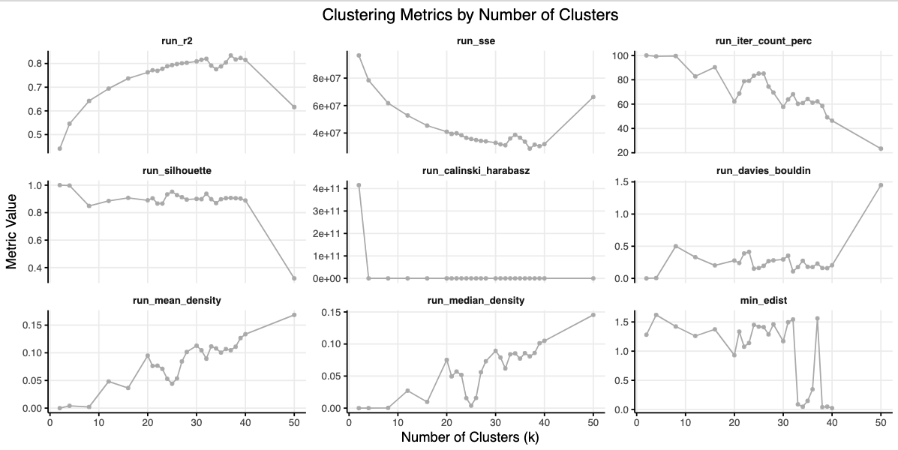
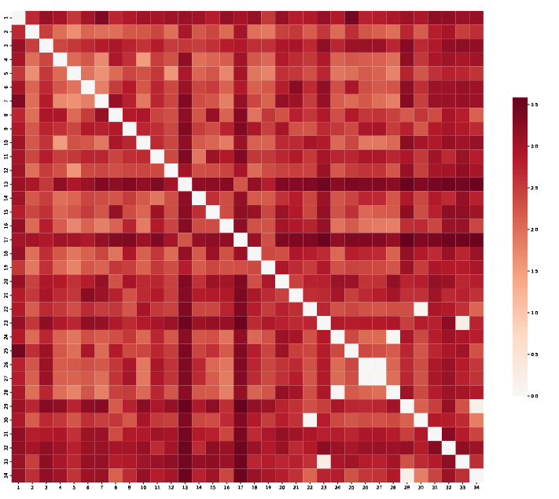
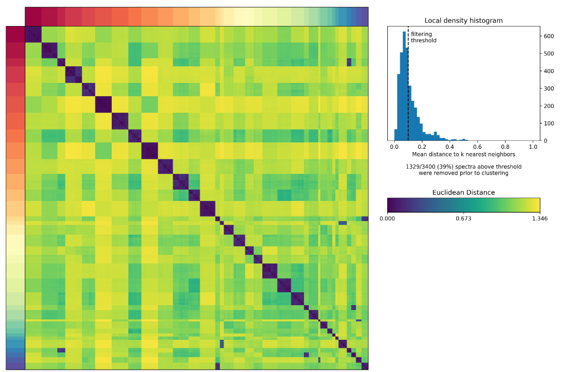

# Understanding cNMF output

The cNMF analysis pipeline produces many output files, which can be overwhelming to inspect at first. This page is meant to make the plots easier to read and interpret. It is broken down into a few key steps. After reading this the page '8 cNMF key notes' contains a point by point summary of good things to understand about cNMF.

## Step 1: Choosing a value of K and assessing the quality of the result

Before moving on to downstream analysis, you first need to choose a value of `K`. There are several useful metrics for that choice. Before discussing them, it helps to review how consensus cNMF is constructed.

### Background on cNMF
To generate the consensus factorization, after preprocessing and HVG selection, the NMF decomposition for a given `K` is run multiple times with different random starts during factorization (controlled by `params.cnmf.n_iter`). This produces `n_iter` gene-spectra matrices, each of dimension `K x HVGs`. It should be noted that the random initializations are dependent on a seed, which is fixed in the pipeline by `params.cnmf.seed`. For a disucssion on this see `8 cNMF key notes`.

These are subsequently merged into one large matrix of `(K * n_iter) x HVGs`. The following steps are then applied to derive a consensus spectra:

1. Each row is normalized to unit L2 norm (`l2_spectra`).
2. A Euclidean distance matrix is derived.
3. The mean distance to the k-nearest-neighbors is computed, and rows above the local-density threshold are removed (controlled by `params.cnmf.local_density`).
4. K-means clustering is applied using the current value for `K`.
5. The median of each cluster is taken and normalized to represent the final raw spectra `H` for each GEP.
6. Usages `W` are estimated on the normalized count matrix `V` by solving `V=W*H`.
7. Prediction error is computed as the sum of squared residuals (`sum((V-V')^2)`).
8. Additional re-fitting is performed on different normalizations to derive `spectra.score` and `spectra.tpm`.

One key determinant of cNMF quality is how consistently spectra from different iterations cluster together. If the result is consistent across iterations, clusters are clean and the cluster medians represent clear programs. If clusters overlap heavily, clustering becomes fuzzy and program weights spread out across programs and genes. Fuzziness may still allow good reconstruction performance, but it makes interpretation much harder, so clean clustering is critical for interpretability.

The key things that make a good program:
- A solid number of iterations to ensure stability (typically 100 is a good starting point)
- As small a mean distance as possible in step 3, while still retaining a high proportion of inputs
- Stable clustering in step 4
- Low prediction error in step 7

### Evaluating if a run is good

The default implementation of cNMF includes two standard plots to help with this evaluation. The first plot (below) shows clustering stability from step 4 (silhouette score) against prediction error from step 7. The goal is to find a good tradeoff: lower error while maintaining stable clustering.

**Figure 1: Silhouette Stability vs. Prediction Error Across K**

One important caveat: this plot is produced without applying the filtering in step 3. That means it only reflects true reconstruction quality when relatively few iterations are filtered out. In practice, at higher values of `K`, many iterations may be filtered, and this is not visible in the standard plot. The result can be a misleading impression of high stability and quality. In sc-blipper, additional plots and metrics are added to address this limitation (described below).

The second plot shows the distance matrix of `l2_spectra` after outlier filtering. It also includes the mean-distance histogram calculated in step 3. Below is an example of clean clustering: the histogram has a strong peak near distance 0, and only about 15% of iterations are removed by the threshold.

**Figure 2: Clean Clustering Example (Distance Matrix and Density Histogram)**

In cases of over-clustering, this heatmap and histogram may look more like this:

**Figure 3: Over-Clustering Example (Distance Matrix and Density Histogram)**

Note the many off-diagonal peaks, the strongly right-skewed histogram, and the large proportion of iterations removed before clustering. If you only look at the error-vs-stability plot, this can still appear acceptable, so inspecting these plots is important.

To support this, sc-blipper produces an additional summary plot in the `k_selection` folder. It serves a similar purpose, but combines several useful metrics in one view. Importantly, these statistics are calculated after density filtering in step 3, so the metrics (especially error) better represent final spectra performance.

**Figure 4: sc-blipper K-Selection Summary Metrics**

The plots include:

1. run_r2: Total variance explained, defined as `1 - (sse / tss)`, where `sse` is sum of squared errors and `tss` is total sum of squares. Higher is better.
2. run_sse: Sum of squared errors (same error concept as the original plot, but computed on filtered spectra). Lower is better.
3. run_iter_count_perc: Percentage of iterations kept after filtering. Ideally above 80%.
4. run_silhouette: Clustering stability score. Values above 0.7 are often reasonable, and higher is better. https://en.wikipedia.org/wiki/Silhouette_(clustering)
5. run_calinski_harabasz: Clustering quality score. Higher is better. https://en.wikipedia.org/wiki/Calinski%E2%80%93Harabasz_index
6. run_davies_bouldin: Clustering quality score. Lower is better. https://en.wikipedia.org/wiki/Davies%E2%80%93Bouldin_index
7. run_mean_density: Mean of the density distribution from step 3. Lower is better, ideally near 0.
8. run_median_density: Median of the density distribution from step 3. Lower is better, ideally near 0.
9. min_edist: Minimum energy distance observed across programs (more below). Energy distance compares between-cluster variation to within-cluster variation. Values above 1 are generally preferred; lower values indicate less clean clustering.

In this example, `k25` (Figure 2) is a good result: variance explained is high (about 80%), retained iterations are high (about 85%), mean and median density are low, and minimal energy distance is high (Figure 4). In contrast, `k50` (Figure 3) is a poor result, with higher error and weaker cluster stability.

## Step 2: Evaluating individual programs

After selecting the most suitable value of `K` for your data, the next step is to quality-control each program to make sure it is robust. sc-blipper offers a couple of metrics to help with this:

1. Number of iterations in the cluster
2. The minimal e-distance (energy distance)

For No. 1, you want the number of iterations in each cluster to closely match the expected count, but not exceed it. If all programs show a close match, this is a good sign that the programs produced are stable.

A second measure is the minimal e-distance, which represents the difference between within-cluster and between-cluster variability in the `l2_spectra` space. You generally want this value to be above 1, in which case clusters should be reasonably distinct. If you have a value of less than 1 or close to zero, it means that the program has a strong resemblance to at least one other program. If this is the case, you can inspect the e-distance heatmap found in the folder for the `K` you selected. In this example, we are looking at the factorization at `K=34`.

**Figure 5: Example e-distance heatmap for factorization at K=34**

In this case, most programs look good, with a high e-distance value. However, a couple of programs show clear overlap. You can then consider removing these programs or choosing a different, more stable value of `K`. We can also see this behavior in the `l2_spectra` heatmap generated by the cNMF package; e-distance is simply a convenient program-level summary of this pattern, making it easier to decide which `K` to select.

**Figure 6: L2 spectra distance heatmap for the example at K=34**

